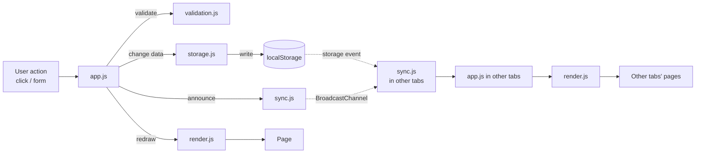
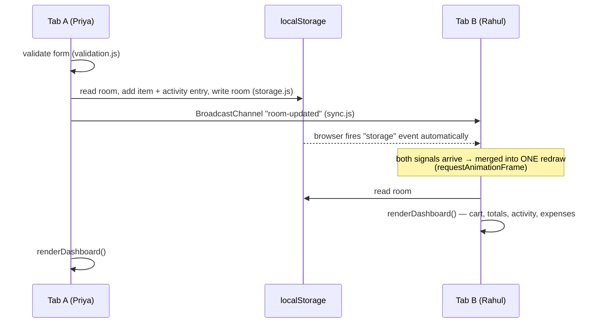

# 02 — Architecture

CartShare is a single-page web app written in plain HTML, CSS and
JavaScript: no framework, no build step, no backend. It runs entirely in
the browser.

## Project structure

```
CartShare-Project/          ← your workspace (not submitted as a whole)
├── CartShare/              ← THE APP: this is what goes to GitHub and gets deployed
│   ├── index.html
│   ├── README.md
│   ├── assets/favicon.svg
│   ├── css/style.css
│   └── js/
│       ├── storage.js
│       ├── sync.js
│       ├── validation.js
│       ├── render.js
│       ├── receipt.js
│       ├── theme.js
│       └── app.js
├── docs/                   ← this documentation, screenshots, presentation notes
└── tests/                  ← automated browser tests + screenshot generator
```

Size: about 2,200 lines across the app's HTML, CSS and JS.

## One job per file

| File | Responsibility | Touches the page? | Changes data? |
|---|---|---|---|
| `storage.js` | Read/write rooms and the tab's identity; totals | No | **Yes** (only file that does) |
| `sync.js` | Notice changes made in other tabs | No | No |
| `validation.js` | Check form input; return an error message or `null` | No | No |
| `render.js` | Draw a room into the page | **Yes** | No |
| `receipt.js` | Build the printable receipt HTML | Yes | No |
| `theme.js` | Light/dark mode | Yes | Only the theme setting |
| `app.js` | React to clicks/forms; call storage, then render | Yes | Via `storage.js` |

This separation keeps each file short and easy to explain: *storage never
draws, render never changes data, app connects the two.*



## Where data lives

| Storage | Key | Shared between tabs? | Holds |
|---|---|---|---|
| `localStorage` | `cartshare_rooms` | **Yes** (whole browser) | Every room, keyed by room code |
| `sessionStorage` | `cartshare_session` | **No** (one per tab) | This tab's identity: `{ userId, userName, roomCode }` |
| `localStorage` | `cartshare_theme` | Yes | `"light"` or `"dark"` |

**Why two kinds of storage?** The cart must be the same in every tab, so
it goes in `localStorage`. *Who you are* must differ per tab, so two tabs
can be two people, so it goes in `sessionStorage`. That split is what
makes the multi-user simulation work.

### Room object

```js
{
  code: "FRQ6KU",
  createdAt: 1758641000000,
  participants: [ { id: "user_…", name: "Priya", joinedAt: 1758641000000 } ],
  items: [ {
    id: "item_…", name: "Milk 1 L", quantity: 6, price: 1.2,
    addedBy: "user_…", addedByName: "Rahul", addedAt: 1758641100000
  } ],
  activity: [ {                     // newest first, capped at 200 entries
    id: "act_…", type: "edit",       // join | leave | add | edit | remove
    userName: "Rahul", detail: "edited \"Milk 1 L\" …", timestamp: 1758641200000
  } ]
}
```

Totals, item counts and per-person contributions are **never stored**.
`computeTotals()` recalculates them from `items` every time, so they can't
get out of step with the cart.

## How a change reaches the other tabs



- The **`storage` event** is built into browsers: when one tab writes to
  `localStorage`, every *other* tab of the same site is notified.
- **`BroadcastChannel`** is a second, explicit message channel used as a backup.
- Because both usually fire for the same change, `onRoomUpdated()` merges them
  so each change causes one redraw, not two.

## Every write follows the same 3 steps

```
1. room = getRoom(code)              read the latest copy from localStorage
2. change room in memory             e.g. push an item, add an activity entry
3. saveRoom(room)                    write it back (this notifies other tabs)
```

Each action returns either `{ room, ... }` or `{ error: "message" }`, so
`app.js` always handles success and failure the same way.

## Page structure (index.html)

- **Header:** logo, room badge (code, Share, Leave; only inside a room), theme toggle
- **Landing view:** pitch, Create/Join tabs with forms, decorative receipt
- **Dashboard view:** participants + Print button; left column: add-item form + cart table; right column: activity log + expense summary
- **Modals:** Leave confirmation; Share/invite
- **`#receipt-print`:** empty on screen; filled just before printing and the only thing shown in print

The two views are switched with the HTML `hidden` attribute; a global
`[hidden] { display: none !important; }` rule guarantees it always wins
(see bug B02 in `04-bug-report.md`).

## Theme system

- All colours are CSS variables on `:root`, redefined under `:root[data-theme="dark"]`.
- A tiny inline script in `<head>` sets `data-theme` **before** the page is
  drawn (saved choice, otherwise the system setting), so there's no white flash.
- `theme.js` handles the toggle button and saves the choice.
- In `@media print` the colour variables are forced to black-on-white.

## Invite links

`Share room` builds `‹current page URL›?room=CODE`. When a page opens with
`?room=`, `handleInviteLink()` switches to the Join tab, fills in the code,
checks the room exists, and shows a banner. After joining, the parameter is
removed from the address bar (`history.replaceState`) so a refresh doesn't
repeat it.
